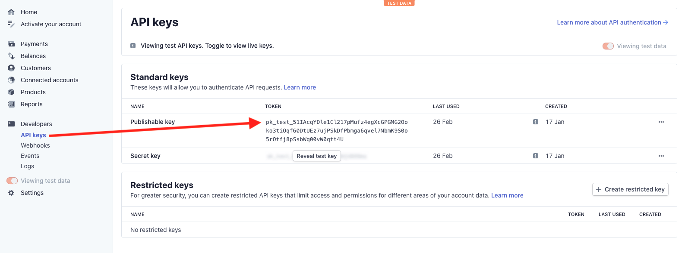
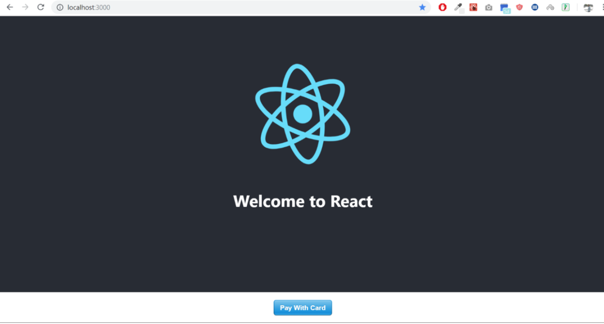
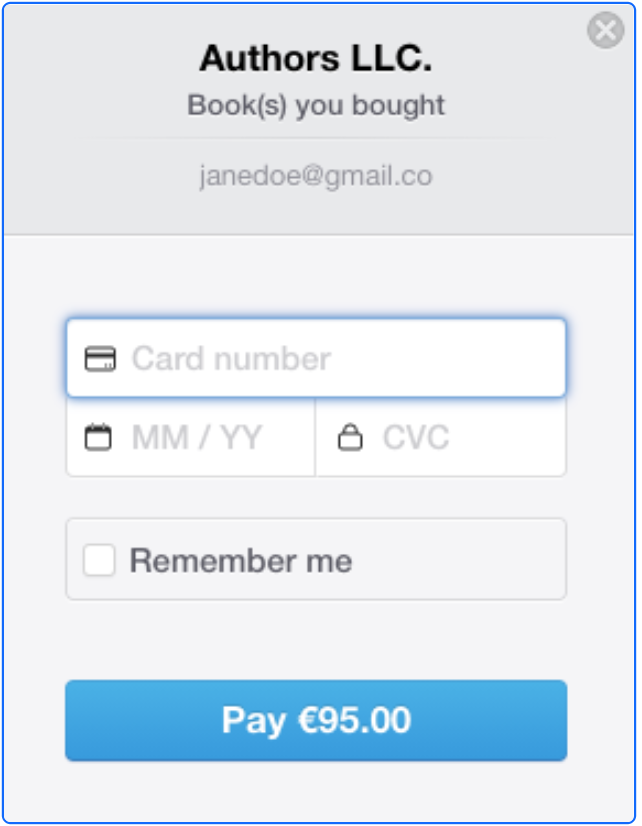

<br />

<p align="center">
  
  <h1 align="center">Stripe Payment System Integration with React</h1>

  <p align="center">
    <i>
    This checklist will set up and integrate the stripe payment system within a <a href="https://reactjs.org/ ">React</a> application.  You will need to complete both this frontend section and the <a href="https://github.com/naomi-carey/Stripe-React-BE-Docs">Back End</a> checklist to successfully integrate the payment system.  We will complete the following tasks:

- Create a Stripe account
- Set up the frontend
- Configure the frontend

  </i>
  <br />
  <br />
  <p align="center">
  <a href="https://github.com/naomi-carey/Stripe-React-FE-Docs">Front End</a>
  ·
  <a href="https://github.com/naomi-carey/Stripe-React-BE-Docs">Back End</a>

</p>
</br>

# Table of Contents

- [Setting up a Stripe account](#setting-up-stripe-account)
  - [Set up the Frontend ](#set-up-frontend)
  - [Configure the Frontend](#set-up-fe-configuration)

</br>

# setting-up-stripe-account

1. Go to the <a href="https://dashboard.stripe.com/register">Stripe</a> registration page and follow the instructions to create an account (no credit card information is needed for developer testing).
2. Once logged in to your Stripe account navigate to **Home>>Developers>>API** Keys. Stripe authenticates your API requests using your account’s API keys. There will be 2 API keys available:

- **Publishable key**: this key starts with “pk“. This can be visible in the frontend code and can be publicly-accessible in your web or mobile app’s code (such as checkout.js). 
- **Secret key**: this key starts with “sk“. This will go in the backend code. This key must be secret and stored securely in your web or mobile app’s backend code (such as in the .env file. ).

<p align="center">
  

---

**NOTE**
These API keys are for the development testing environment. There are different API keys for the production environment.

---

The main frameworks and technologies used to build our Project are the following:

- React (with _Hooks_ and _Context_)
- React Router
- Styled Components

## set-up-frontend

1. Set up the React application and change directory into **/frontend**.

```
   mkdir react-stripe-project
   cd react-stripe-project
   npx create-react-app frontend
   cd frontend
```

2. Install Axios and React Stripe Checkout.

```
   npm install axios react-stripe-checkout
```

3. In the **src/components** directory, create a **Checkout.js** file.

```
   touch Checkout.js
```

4. Create directory **constants** and create files **server.js** and **stripe.js**.

```
   mkdir constants
   cd constants
   touch server.js stripe.js
```

## set-up-fe-configuration

5. In the **App.js** file add the below code. The below is importing the <Checkout/> module from **Checkout.js** file just created.

```javascript
import React, { Component } from "react";
import Checkout from "./Checkout";
import "./App.css";

class App extends Component {
  render() {
    return (
      <div className="App">
        <div className="App-header">
          <h2>Welcome to React</h2>
        </div>
        <p className="App-intro">
          <Checkout
            name={"Your Company Name"}
            description={"Item that you sold"}
            amount={4.99}
          />
        </p>
      </div>
    );
  }
}

export default App;
```

---

**NOTE**
Do not forget to pass the appropriate variables in this area. For example company name, item purchased, and amount to process. This is what will be shown in the customer’s credit card statement.

---

6. In the **Checkout.js** file add the below code. Below the user data is submitted through StripeCheckout. This will send all the credit card credentials to stripe and then will return a TOKEN ID. This TOKEN ID will be used to ping the node.js express server in the backend (once we set this up). The backend will then post the payment to Stripe.

```javascript
import React from "react";
import axios from "axios";
import StripeCheckout from "react-stripe-checkout";

import STRIPE_PUBLISHABLE from "./constants/stripe";
import PAYMENT_SERVER_URL from "./constants/server";

const CURRENCY = "EUR";

const fromDollarToCent = (amount) => parseInt(amount * 100);

const successPayment = (data) => {
  alert("Payment Successful");
};

const errorPayment = (data) => {
  alert("Payment Error");
};

const onToken = (amount, description) => (token) =>
  axios
    .post(PAYMENT_SERVER_URL, {
      description,
      source: token.id,
      currency: CURRENCY,
      amount: fromDollarToCent(amount),
    })
    .then(successPayment)
    .catch(errorPayment);

const Checkout = ({ name, description, amount }) => (
  <StripeCheckout
    name={name}
    description={description}
    amount={fromDollarToCent(amount)}
    token={onToken(amount, description)}
    currency={CURRENCY}
    stripeKey={"YOUR_STRIPE_PUBLISHABLE_KEY"}
    zipCode
    email
    allowRememberMe
  />
);

export default Checkout;
```

---

**NOTE**
Under the variable "stripeKey=" make sure to use the API key that starts with “pk“ not “sk“. Do not forget to put the stripe key in “quotes”. Also use the appropriate currency for your country, this example uses euro. For other supported currencies see <a href="https://stripe.com/docs/currencies">Stripe Supported Currencies</a>.

---

7.  In the **src/components/constants** directory, add the following code to the **server.js** file. This designates which server to call. When this application is ready for production, this is where to put the backend production address. For the development environment use localhost port 8080.

```javascript
const PAYMENT_SERVER_URL =
  process.env.NODE_ENV === "production"
    ? "http://localhost:8080"
    : "http://localhost:8080";

export default PAYMENT_SERVER_URL;
```

8. In the  **src/components/constants** directory, add the following code to the **stripe.js** file. Use the publishable key starting with “pk”. Add one for the production environment (live) and testing environment (test). These are both located in the Stripe dashboard.

```javascript
const STRIPE_PUBLISHABLE =
  process.env.NODE_ENV === "production"
    ? "pk_live_MY_PUBLISHABLE_KEY"
    : "pk_test_MY_PUBLISHABLE_KEY";

export default STRIPE_PUBLISHABLE;
```

9. At this point the frontend environment is set up. Start the server by running the below:

```
cd ~/frontend
npm start
```

<p align="center">
If successful the below screen will display:

<p align="center">
 

<p align="center">
Click “pay with card” and the following pop-up will display:

<p align="center">
 

10. Continue to the next section to create the <a href="https://github.com/naomi-carey/Stripe-React-BE-Docs">back end</a>.

## [:top:](#table-of-contents)
